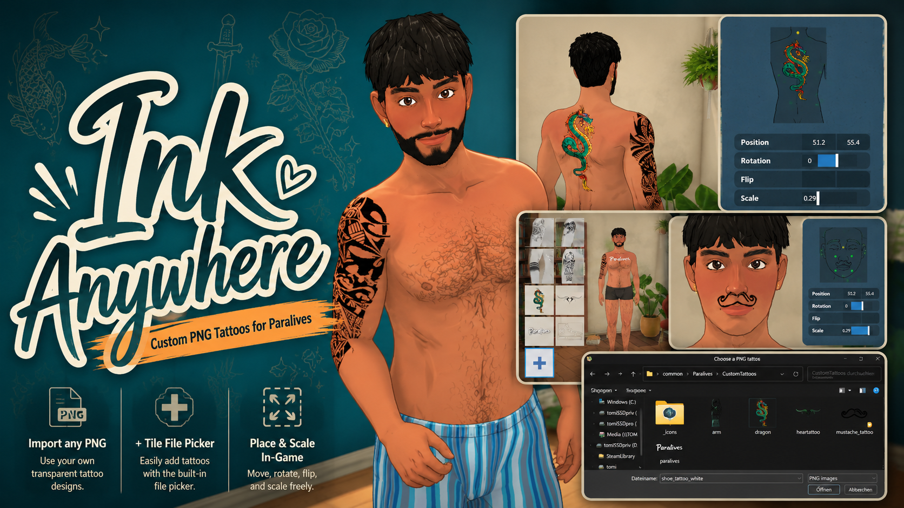
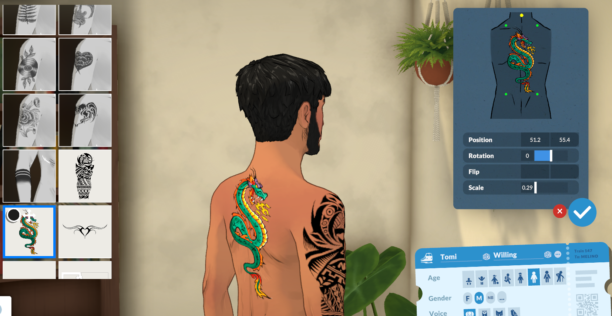
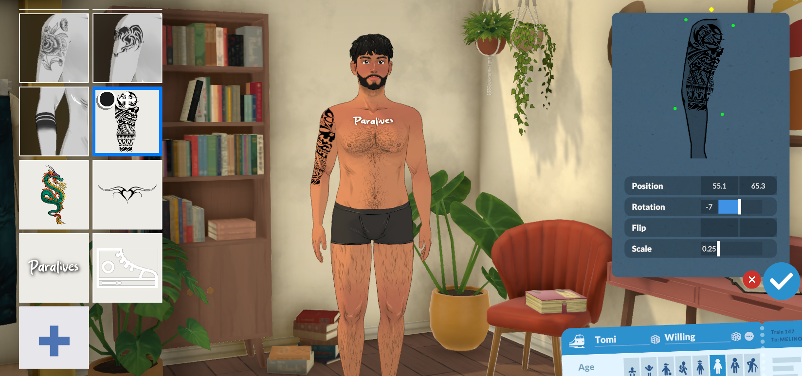
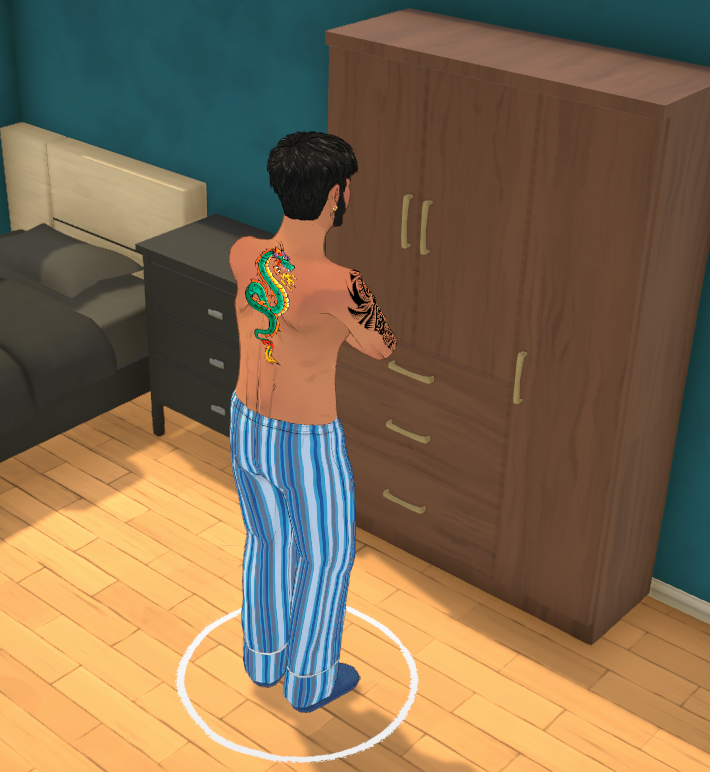
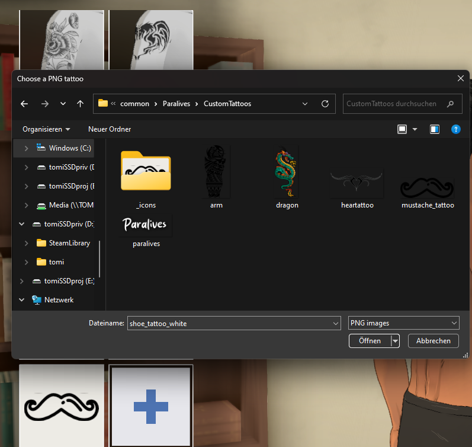

# Ink Anywhere — custom PNG tattoos for Paralives

<p align="center">
  
</p>

Import **any PNG** (transparent background) as a real, placeable, **full-color**
tattoo in Paralives. Drop images in a folder — or add them live in-game with a
**"+" tile** in the tattoo catalog that opens a file picker. They behave like
built-in tattoos: move / scale / rotate / flip with the game's own decal tools.

A [BepInEx](https://github.com/BepInEx/BepInEx) (Unity / C#) script mod. Not for
the Steam Workshop (script mods aren't allowed there) — share via GitHub / Nexus.

<p align="center">
  <a href="https://ko-fi.com/t0m13"></a>
  <a href="https://www.patreon.com/c/T0M1"></a>
</p>

## Download

<p align="center">
  <a href="https://github.com/T0M13/Ink-Anywhere/releases/latest/download/InkAnywhere_0.2.0_Beta.zip">
    
  </a>
</p>

Download the release zip from the [latest GitHub release](https://github.com/T0M13/Ink-Anywhere/releases/latest) or from
[Nexus Mods](https://www.nexusmods.com/paralives/mods/154). Players do **not**
need to build this project.

See [CHANGELOG.md](CHANGELOG.md) for release notes.

## Features

- Import any PNG as a tattoo — full color, transparency preserved.
- **In-game "+" tile** (last in the tattoo grid) → native PNG file picker → instant add.
- Or just drop PNGs into the `CustomTattoos` folder; they auto-load on startup.
- Tidy auto-generated catalog thumbnails (image fit + centered on a light background).
- Wider decal scaling than vanilla (0.05–6 instead of 0.25–1.5).
- Stable: invalid images are skipped, and deleting a PNG cleanly removes its tattoo.

## Screenshots

<p align="center">
  
  
</p>

<p align="center">
  
  
</p>

## Install

1. Install **BepInEx 5 (x64, Mono)** into your Paralives folder.
2. Run Paralives once, then close it.
3. Download `InkAnywhere_0.2.0_Beta.zip` from the
   [latest release](https://github.com/T0M13/Ink-Anywhere/releases/latest/download/InkAnywhere_0.2.0_Beta.zip).
   Do not download the source code zip unless you want the project files.
4. Extract the zip into your Paralives game folder.
5. Confirm the DLL is here:
   `…/Paralives/BepInEx/plugins/InkAnywhere/ParalivesInkAnywhere.dll`
6. Launch Paralives. Add PNGs via the in-game **+** tile, or place them in:
   `…/Paralives/CustomTattoos/`

## Build from source

```powershell
dotnet build -c Release
```

Paths to your install are set in `ParalivesInkAnywhere.csproj` (`GameManaged`,
`GameRoot`, `PluginsDir`). The build auto-copies the DLL into the plugins folder.

## How it works

The mod never edits game files. At runtime it:

1. **Loads each PNG** into a `Texture2D` and registers it with the game's
   `AssetManager` under a stable GUID (FNV-1a hash of the filename).
2. **Clones an existing tattoo** `EquipmentItem` (reusing its tags / swatch /
   decal-section data), repoints it at our texture, sets `ShaderType.NonRecolorable`
   (so the PNG keeps its own colors), and appends it to `Settings.Get<Equipment>()`.
   The native catalog and decal-placement UI then treat it like any tattoo.
3. A **watchdog** re-asserts our textures every frame — the game periodically
   unloads them and its own reload returns null, which would NRE the skin
   compositor; we reload from disk to prevent that.
4. The **"+" tile** is an injected `EquipmentItem`; a Harmony prefix on
   `UIEquipmentItem.OnListItemClicked` intercepts clicks on it to open a Win32
   PNG file picker instead of equipping.

### Notes / gotchas

- BepInEx's manager object doesn't tick `Update`/`OnGUI` on this game, so all
  per-frame logic runs on a self-spawned `GameObject`.
- Harmony must use BepInEx's bundled `0Harmony.dll` (referencing the newer
  HarmonyX NuGet pulls a `MonoMod.Backports` dependency that isn't deployed).
